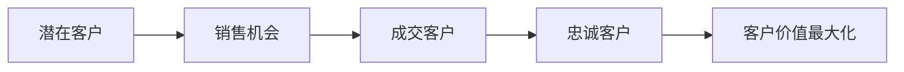

# 软考系统架构师：信息系统基础知识全面解析 🏢

> 📅 **发布时间**：2025年8月25日  
> 🎯 **考试重点**：信息系统分类、企业资源规划、客户关系管理  
> ⭐ **难度等级**：★★★☆☆

---

## 🌟 引言：信息系统的江湖世界

想象一下，企业就像一个复杂的生态系统，而信息系统就是这个生态系统的"神经网络"。从最基础的数据处理，到高层决策支持，每一个系统都有自己独特的"武功绝学"。今天我们就来探索这个信息系统的江湖世界！

---

## 📊 第一章：信息系统的五大门派

### 1️⃣ TPS (事务处理系统) - 基础武功派 💪

**重点考点：TPS是所有信息系统的基础，必考！**

**形象比喻**：TPS就像企业的"收银员"，负责处理日常的基础业务。

<h4>🔥 TPS核心特征：</h4>
<ul>
<li><strong>实时性</strong>：像闪电一样快速处理交易</li>
<li><strong>可靠性</strong>：绝不能出错的"铁饭碗"</li>
<li><strong>大容量</strong>：能同时服务千万用户</li>
<li><strong>数据完整性</strong>：ACID特性保驾护航</li>
</ul>

**经典应用场景**：
- 🏦 银行转账系统（一分钱都不能错！）
- 🛒 电商下单系统（双11的考验）
- ✈️ 机票预订系统（座位分配的艺术）

### 2️⃣ MIS (管理信息系统) - 中层管理派 📈

**考试要点：MIS在TPS基础上提供管理功能**

**形象比喻**：MIS是企业的"部门经理"，把基础数据整理成有用的管理报表。

<h4>📊 MIS核心功能：</h4>
<ul>
<li><strong>数据汇总</strong>：从海量数据中提炼精华</li>
<li><strong>报表生成</strong>：让数字会说话</li>
<li><strong>异常监控</strong>：发现问题的"火眼金睛"</li>
<li><strong>流程管理</strong>：让工作井然有序</li>
</ul>

**实际案例**：
- 📊 销售业绩统计系统
- 🏭 生产管理系统
- 💼 人力资源管理系统

### 3️⃣ DSS (决策支持系统) - 智囊团派 🧠

**重点难点：DSS具有分析和预测能力，常考建模方法**

**形象比喻**：DSS是企业的"诸葛亮"，运筹帷幄，决胜千里。

<h4>🎯 DSS三大组件</h4>
<ul>
<li><strong>数据库子系统</strong>：数据仓库</li>
<li><strong>模型库子系统</strong>：算法宝典</li>
<li><strong>对话子系统</strong>：人机交互</li>
</ul>

**典型应用**：
- 📈 股票投资分析系统
- 🌍 市场预测系统
- 🚀 战略规划系统

### 4️⃣ ES (专家系统) - 专家顾问派 👨‍🔬

**AI考点：基于知识推理的人工智能应用**

**形象比喻**：ES是企业的"老中医"，拥有丰富的专业知识和诊断能力。

<h4>🧬 专家系统结构：</h4>
<ul>
<li><strong>知识库</strong>：专家的智慧结晶</li>
<li><strong>推理机</strong>：逻辑思维引擎</li>
<li><strong>解释机</strong>：说明推理过程</li>
<li><strong>知识获取</strong>：学习新知识</li>
</ul>

### 5️⃣ OAS (办公自动化系统) - 效率提升派 ⚡

**实用系统：提高办公效率的综合平台**

**形象比喻**：OAS是企业的"超级助手"，让办公变得轻松高效。

**核心功能**：
- 📧 电子邮件系统
- 📝 文档管理系统
- 🗓️ 日程安排系统
- 💬 即时通讯系统

---

## 🏢 第二章：企业级系统三剑客

### ⚔️ ERP (企业资源规划) - 统一江湖 👑

**必考重点：ERP是企业信息化的核心，理解其发展历程和核心模块**

**形象比喻**：ERP就像企业的"中央政府"，统一管理所有资源。

<h4>🏛️ ERP发展历程：</h4>
<ol>
<li><strong>MRP</strong> (物料需求计划) - 古代的"粮草先行"</li>
<li><strong>MRP II</strong> (制造资源计划) - 工业革命时代</li>
<li><strong>ERP</strong> (企业资源规划) - 现代信息化时代</li>
</ol>

<h4>💼 ERP核心模块</h4>
<ul>
<li><strong>财务管理</strong>：企业的"钱袋子" 💰</li>
<li><strong>采购管理</strong>：供应链的"采购员" 🛒</li>
<li><strong>销售管理</strong>：市场的"推广员" 📈</li>
<li><strong>库存管理</strong>：仓储的"管家" 📦</li>
<li><strong>生产管理</strong>：工厂的"调度员" 🏭</li>
<li><strong>人力资源</strong>：团队的"伯乐" 👥</li>
</ul>

**考试重点记忆法**：
- ERP = Enterprise Resource Planning
- 核心思想：整合企业所有资源
- 实施难点：业务流程重组(BPR)

### 🎯 CRM (客户关系管理) - 客户至上 💕

**考点重点：CRM以客户为中心的管理理念**

**形象比喻**：CRM是企业的"红娘"，专门维护客户关系。

<h4>💝 CRM三大核心：</h4>
<ul>
<li><strong>销售自动化(SFA)</strong>：销售过程的"GPS导航"</li>
<li><strong>营销自动化(MA)</strong>：精准营销的"狙击手"</li>
<li><strong>客户服务(CS)</strong>：贴心服务的"管家"</li>
</ul>

**CRM价值链**：

### 🚚 SCM (供应链管理) - 物流专家 📦

**重要概念：供应链的协同管理**

**形象比喻**：SCM是企业的"物流指挥官"，统筹整个供应链。

<h4>🔗 供应链五环节</h4>
<ol>
<li><strong>供应商管理</strong>：上游合作伙伴</li>
<li><strong>采购管理</strong>：原材料获取</li>
<li><strong>生产管理</strong>：价值创造</li>
<li><strong>配送管理</strong>：物流运输</li>
<li><strong>客户管理</strong>：终端服务</li>
</ol>

---

## 🌐 第三章：电子商务模式全景图

### 💼 B2B (企业对企业) - 批发市场 🏢

**商务模式：企业间的大宗交易平台**

**形象比喻**：B2B就像"批发市场"，企业之间进行大宗交易。

**典型特征**：
- 🔢 交易金额大
- 📋 业务流程复杂
- 🤝 长期合作关系
- 📊 数据集成要求高

### 🛒 B2C (企业对消费者) - 零售商店 🏪

**最常见的电商模式，消费者直接购买**

**形象比喻**：B2C就像"超市购物"，消费者直接选购商品。

**成功要素**：
- 🎨 用户体验优秀
- 🚚 物流配送快速
- 💳 支付安全便捷
- 🛡️ 售后服务完善

### 👥 C2C (消费者对消费者) - 跳蚤市场 🛍️

**个人交易平台，平台提供交易环境**

**形象比喻**：C2C就像"跳蚤市场"，个人之间自由交易。

### 🌍 O2O (线上到线下) - 新零售模式 🔄

**新兴模式：线上线下融合发展**

**形象比喻**：O2O就像"外卖平台"，线上下单，线下服务。

---

## 🎯 第四章：考试重点速记宝典

### 📚 核心概念记忆法

<h4>🧠 系统架构师必背口诀：</h4>
<ul>
<li><strong>TPS基础稳</strong>：事务处理是根本</li>
<li><strong>MIS管中层</strong>：管理信息系统</li>
<li><strong>DSS助决策</strong>：决策支持系统</li>
<li><strong>ES专家智</strong>：专家系统有智慧</li>
<li><strong>OAS提效率</strong>：办公自动化</li>
</ul>

### 🎲 企业系统三剑客速记

<h4>⚔️ 记忆口诀：</h4>
<ul>
<li><strong>ERP统资源</strong>：Enterprise Resource Planning</li>
<li><strong>CRM管客户</strong>：Customer Relationship Management</li>
<li><strong>SCM控供应</strong>：Supply Chain Management</li>
</ul>

### 🛍️ 电商模式速记表

<table>
<thead>
<tr>
<th>模式</th>
<th>中文名称</th>
<th>特点</th>
<th>代表平台</th>
</tr>
</thead>
<tbody>
<tr>
<td>B2B</td>
<td>企业对企业</td>
<td>批发交易</td>
<td>阿里巴巴</td>
</tr>
<tr>
<td>B2C</td>
<td>企业对消费者</td>
<td>零售购物</td>
<td>天猫、京东</td>
</tr>
<tr>
<td>C2C</td>
<td>消费者对消费者</td>
<td>个人交易</td>
<td>淘宝、闲鱼</td>
</tr>
<tr>
<td>O2O</td>
<td>线上到线下</td>
<td>融合服务</td>
<td>美团、饿了么</td>
</tr>
</tbody>
</table>

---

## 🎯 第五章：实战演练与真题解析

### 💡 经典考题类型分析

<h4>📝 常考题型：</h4>
<ol>
<li><strong>系统分类判断题</strong>：给定场景，判断属于哪种信息系统</li>
<li><strong>ERP模块组成题</strong>：考查ERP的核心模块</li>
<li><strong>电商模式识别题</strong>：根据交易特征判断商务模式</li>
<li><strong>系统集成方案题</strong>：设计企业信息化解决方案</li>
</ol>

### 🏆 答题技巧总结

**核心策略：理解系统本质，掌握分类标准**

1. **系统分类记忆**：按照服务层级从低到高排序
2. **功能导向分析**：根据主要功能判断系统类型
3. **应用场景匹配**：结合实际业务场景理解
4. **发展历程把握**：了解技术演进过程

---

## 🌟 总结：信息系统的未来展望

随着云计算、大数据、人工智能等新技术的快速发展，传统的信息系统正在经历深刻的变革。作为系统架构师，我们不仅要掌握经典的系统架构知识，更要紧跟技术发展趋势，在传承中创新，在创新中发展。

<h4>🚀 学习建议：</h4>
<ul>
<li><strong>理论联系实际</strong>：结合工作经验理解概念</li>
<li><strong>系统性学习</strong>：构建完整的知识体系</li>
<li><strong>持续关注前沿</strong>：了解最新技术趋势</li>
<li><strong>多做练习</strong>：通过真题强化记忆</li>
</ul>

愿每一位系统架构师都能在信息系统的江湖中，练就一身好武艺，成为企业数字化转型的中流砥柱！

---

> 💫 **下期预告**：我们将深入探讨《软件架构设计模式与最佳实践》，敬请期待！  
> 🎯 **考试提醒**：信息系统基础知识约占考试总分的15-20%，务必熟练掌握！

